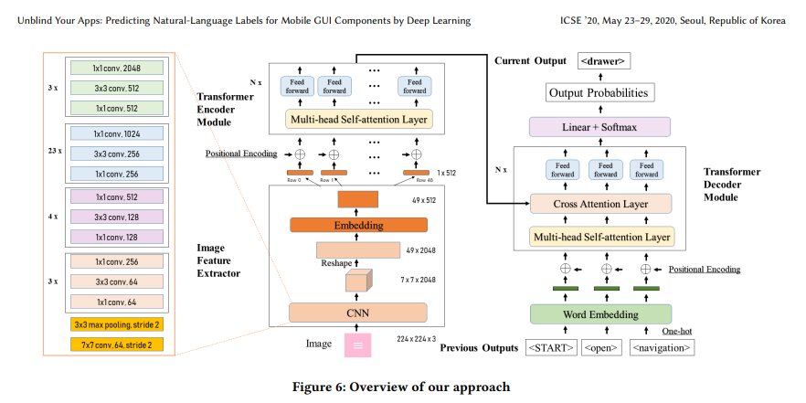
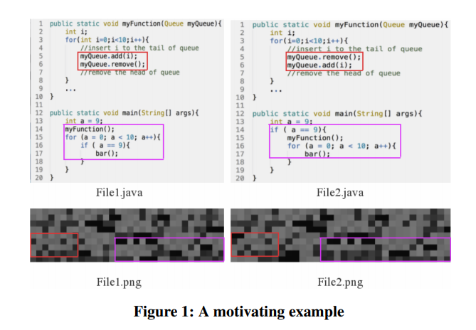
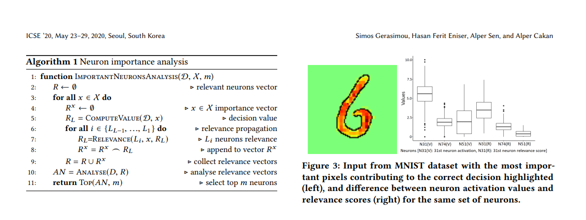
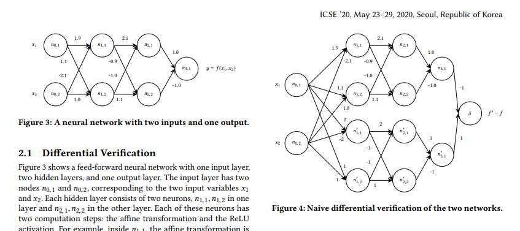
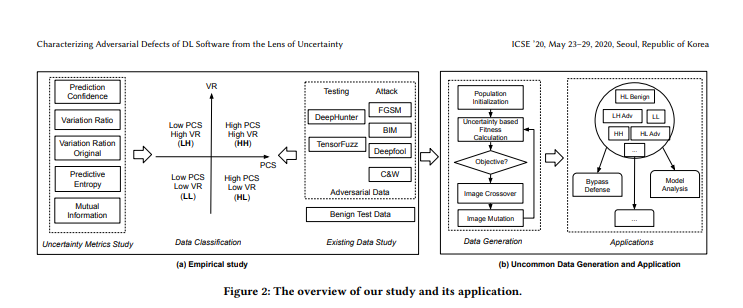

icse 2020
---------

- Unblind Your Apps: Predicting Natural-Language Labels for Mobile GUI Components by Deep Learning
   https://arxiv.org/pdf/2003.00380.pdf

android app usiabllity for blind ppl is always a challenge. so many apps are having icon buttons without label on it or any substitute infomation to retrive the infomation to help blind ppl understand the button. there are built-in apps that parse the source apk and read the lable loud for blind ppl. but if the button is not giving such information. than it can not be read. this work collected 190000 apps. for apps has label and the icon. it collect both. it throws them into a model and then use the model to generate the label for those apps that have only the icon but not the text lable. not yet sure how they compare their work. 

- Software Visualization and Deep Transfer Learning for Effective Software Defect Prediction
   http://yuyue.github.io/res/paper/DTLDP_ICSE2020.pdf
   

- Importance-Driven Deep Learning System Testing
   https://arxiv.org/pdf/2002.03433.pdf
   
   new hints:
   DeepXplore
   DeepGauge

   

- ReluDiff: Differential Verification of Deep Neural Networks
   https://arxiv.org/pdf/2001.03662.pdf
   
   new hints:
   ReluVal
   DeepPoly   
   
 compare the diff between two networks. dont really understand whats in it
 

- DISSECTOR: Input Validation for Deep Learning Applications by Crossing-layer Dissection

- Towards Characterizing Adversarial Defects of Deep Learning Software from the Lens of Uncertainty
   https://arxiv.org/pdf/2004.11573.pdf

emperical study on Bengin exampls and adverserial examples and how to generate them.

- White-box Fairness Testing through Adversarial Sampling

- Structure-Invariant Testing for Machine Translation
   https://arxiv.org/pdf/1907.08710.pdf

- Automatic Testing and Improvement of Machine Translation
   https://arxiv.org/pdf/1910.02688.pdf

- TRADER: Trace Divergence Analysis and Embedding Regulation for Debugging Recurrent Neural Networks

- Taxonomy of Real Faults in Deep Learning Systems

- Repairing Deep Neural Networks: Fix Patterns and Challenges

- Fuzz Testing based Data Augmentation to Improve Robustness of Deep Neural Networks

- An Empirical Study on Program Failures of Deep Learning Jobs
