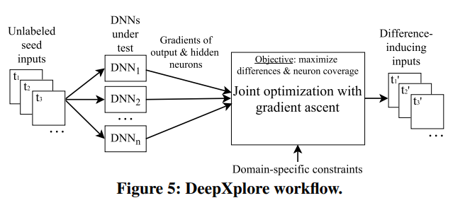

There are alreay many exisiting works on adverserial testing against deep learning models. 

Pei et al. 2017 presented a whitebox testing framework for DL system 
Lei et al. 2018

DeepXplore: Automated Whitebox Testing of Deep Learning Systems
Kexin et al 2017

white box testing

dataset:
including Udacity self-driving car challenge data, image data
from ImageNet and MNIST, Android malware data from
Drebin, and PDF malware data from Contagio/VirusTotal.

performance: 
The
inputs generated by DeepXplore achieved 34.4% and 33.2%
higher neuron coverage on average than the same number of
randomly picked inputs and adversarial inputs

workflow:

   We design, implement, and evaluate DeepXplore, the first
   whitebox framework for systematically testing real-world DL
   systems. First, we introduce neuron coverage for systematically measuring the parts of a DL system exercised by test
   inputs. Next, we leverage multiple DL systems with similar
   functionality as cross-referencing oracles to avoid manual
   checking. Finally, we demonstrate how finding inputs for
   DL systems that both trigger many differential behaviors and
   achieve high neuron coverage can be represented as a joint
   optimization problem and solved efficiently using gradientbased search techniques.
@inproceedings{pei2017deepxplore,
  title={Deepxplore: Automated whitebox testing of deep learning systems},
  author={Pei, Kexin and Cao, Yinzhi and Yang, Junfeng and Jana, Suman},
  booktitle={proceedings of the 26th Symposium on Operating Systems Principles},
  pages={1--18},
  year={2017}
}

DeepGauge: multi-granularity testing criteria for deep learning systems
Lei et al . 2018
whitebox
dataset:
MNIST Imagenet

idea:
 5 types of coverage metrics:
 KMNC NBC SNAC TKNC TKNP

In this paper,
we propose DeepGauge, a set of multi-granularity testing criteria
for DL systems, which aims at rendering a multi-faceted portrayal
of the testbed. The in-depth evaluation of our proposed testing
criteria is demonstrated on two well-known datasets, five DL systems, and with four state-of-the-art adversarial attack techniques
against DL.

Houdini 
Moustapha et al. 2017
   We introduce a novel flexible approach named Houdini for
   generating adversarial examples specifically tailored for the final performance
   measure of the task considered, be it combinatorial and non-decomposable.

DeepConcolic: Testing and Debugging Deep Neural Networks
Youcheng et al 2019

   DeepConcolic is the first tool that implements a concolic testing technique for DNNs

Adversarial Sample Detection for Deep Neural Network through Model Mutation Testing
Wang  et al 2019 icse

Wang et al. designed an approach for adverserial input detection and blocking at runtime 

Symbolic Execution for Attribution and Attack Synthesis in Neural Networks
 Gopinath et al.  2019 ICSE

   DeepCheck implements techniques for lightweight symbolic
   analysis of DNNs and applies them in the context of image classification to address two challenging problems: 1) 
   identification
   of important pixels (for attribution and adversarial generation);
   and 2) creation of adversarial attacks. 

Formal Security Analysis of Neural Networks using Symbolic Intervals
Shiqi et al 2018 usenix

   In this paper, we present a new direction for formally
   checking security properties of DNNs without using SMT
   solvers. Instead, we leverage interval arithmetic to compute rigorous bounds on the DNN outputs. 

Efficient Formal Safety Analysis of Neural Networks
Shiqi ET AL 2018 NIPS
   
   In this paper, we present a new efficient approach for rigorously checking
   different safety properties of neural networks that significantly outperforms existing
   approaches by multiple orders of magnitude.

Deepmutation: Mutation testing of deep learning systems
lei et al. 2018
   In this paper, we
   propose a mutation testing framework specialized for DL systems
   to measure the quality of test data.

Testing deep neural networks
 Sun et al 2019
 
   In this paper, inspired by the MC/DC coverage criterion, we
   propose a family of four novel test criteria that are tailored to structural features
   of DNNs and their semantics.
 
 
DeepRoad: GAN-based metamorphic testing and input validation framework for autonomous driving systems
Zhang et al 2018

   In this paper, we propose DeepRoad, an unsupervised DNN-based
   framework for automatically testing the consistency of DNN-based
   autonomous driving systems and online validation. 

Tensorfuzz: Debugging neural networks with coverage-guided fuzzing
Odena et al 2019 

   We introduce testing techniques for neural networks that
   can discover errors occurring only for rare inputs. Specifically, we develop coverage-guided fuzzing (CGF)
   methods for neural networks.

Guiding deep learning system testing using surprise adequacy
Kim et al 2019

   We propose a novel test
   adequacy criterion for testing of DL systems, called Surprise
   Adequacy for Deep Learning Systems (SADL), which is based
   on the behaviour of DL systems with respect to their training
   data.
   
Simulation-based adversarial test generation for autonomous vehicles with machine learning components
Cumhur et al 2018

   We present a testing framework that
   is compatible with test case generation and automatic falsification methods, which are used to evaluate cyber-physical systems. We demonstrate how the framework can be used to evaluate closed-loop
   properties of an autonomous driving system model that includes the ML components, all within a virtual environment. 

A Quantitative Analysis Framework for Recurrent Neural Network
Du et al 2019

   In this paper, we
   propose a quantitative analysis framework — DeepStellar—
   to pave the way for effective quality and security analysis of
   software systems powered by RNNs. DeepStellar is generic to
   handle various RNN architectures, including LSTM and GRU,
   scalable to work on industrial-grade RNN models, and extensible
   to develop customized analyzers and tools.

Strike (with) a pose: Neural networks are easily fooled by strange poses of familiar objects
Alcorn et al 2019

   In this paper, we present a framework for discovering DNN
   failures that harnesses 3D renderers and 3D models.

Towards practical verification of machine learning: The case of computer vision systems
Pei et al 2017

   In this paper, we propose a generic
   framework for evaluating security and robustness of ML systems
   using different real-world safety properties.

Dlfuzz: Differential fuzzing testing of deep learning systems
Guo et al 2018

   In this paper, we propose DLFuzz, the first differential fuzzing
   testing framework to guide DL systems exposing incorrect behaviors.

CRADLE: Cross-Backend Validation to Detect and Localize Bugs in Deep Learning Libraries
Pham et al 2019

   Thus, we propose CRADLE, a new approach that focuses on
   finding and localizing bugs in DL software libraries. CRADLE (1)
   performs cross-implementation inconsistency checking to detect
   bugs in DL libraries, and (2) leverages anomaly propagation
   tracking and analysis to localize faulty functions in DL libraries
   that cause the bugs. We evaluate CRADLE on three libraries
   (TensorFlow, CNTK, and Theano)

Testing DNN Image Classifiers for Confusion & Bias Errors
Tian et al 2019

  We developed a testing technique to automatically detect classbased confusion and bias errors in DNN-driven image classification
  software. 

AsFault: Testing Self-Driving Car Software Using Search-Based Procedural Content Generation
Gambi et al. 2019 

   we developed ASFAULT, a tool for automatically generating
   virtual tests for systematically testing self-driving car software.
   We demonstrate ASFAULT by testing the lane keeping feature
   of an artificial intelligence-based self-driving car software, for
   which ASFAULT generates scenarios that cause it to drive off
   the road.

Pei et al. (2017) presented a whitebox testing framework for DL system.

Ma et al. (2018) purposed 5 testing criterias for DL system
Cisse et al. (2017) introduced the Houdini approach for adverserial examples generation 
 
Goodfellow et al. (2015) purposed Fast Gradient Sign Method(FGSM) for adverserial example generation.

Kurakin et al. (2017) introduced Basin Iterative method for  for adverserial example generation.

Carlini et al. (2017) introduced Carlini/Wagner attack (CW) method for adverserial example generation.

Papernot et al. (2016) proposed Jacobian-based Saliency Map
Attack (JSMA) for adversierial attack on deeplearning model 

Sun et al. (2019) introduced DeepConcolic for DNNs testing using concolic-based testing approach 

Wang et al. (2019) designed an approach for adverserial input detection and blocking at runtime

Gopinath et al. (2019) proposed Deepcheck for DNNs adverserail attack using symbolic analysis approach

Wang et al. (2018) presented an arithmetic method to calculate the rigorous bounds on DNN outputs 

Ma et al. (2018) proposed a mutation testing framework for DL system for testing data quality measurement

Sun et al. (2019) proposed four criteria for testing DNNs structural features.

Zhang et al. (2018) designed an unsupervised DNN for input validation on autonomous driving system

Odena et al. (2019) applied fuzz-based coverage testing  for DL system

Kim et al. (2019) proposed an adequacy criterion for DL systems 

Tuncali et al. proposed an adverseral test generation method on virtural environment for autonomous vehicles.

Du et al. proposed DeepStellar for RNN-based system security analysis.

Alcorn et al. proposed a 3d rederer-based framwork that generates adverserial examples for DNNs.

Pei et al. proposed a security and robostness evaluation framework for ML system.

Guo et al. proposed DLFuzz, a fuzz-based testing for DL system.

Pham et al. proposed CRADLE , a cross-implementation DNN  inconsistency checking approach for DNN bug detection.

Tian et al. proposed a classbased confusion and bias errors testing in DNNs for image classification tasks

Gambi et al. proposed ASFAULT, a Prodecural generation tool for autonomous driving DL systems.
